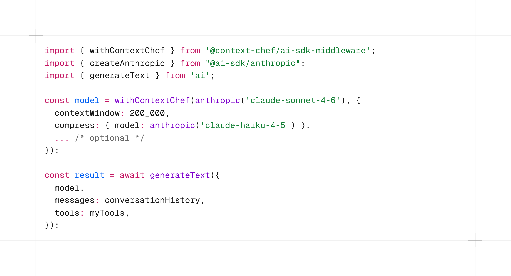

# @context-chef/ai-sdk-middleware

[](https://www.npmjs.com/package/@context-chef/ai-sdk-middleware)
[](https://www.npmjs.com/package/@context-chef/ai-sdk-middleware)
[](https://github.com/MyPrototypeWhat/context-chef/blob/main/LICENSE)
[](https://www.typescriptlang.org/)
[](https://ai-sdk.dev)

[Vercel AI SDK](https://ai-sdk.dev) middleware powered by [context-chef](https://github.com/MyPrototypeWhat/context-chef). Transparent history compression, tool result truncation, and token budget management — zero code changes required.



## Installation

```bash
npm install @context-chef/ai-sdk-middleware ai
```

## Quick Start

```typescript
import { withContextChef } from '@context-chef/ai-sdk-middleware';
import { openai } from '@ai-sdk/openai';
import { generateText } from 'ai';

const model = withContextChef(openai('gpt-4o'), {
  contextWindow: 128_000,
  compress: { model: openai('gpt-4o-mini') },
  truncate: { threshold: 5000, headChars: 500, tailChars: 1000 },
});

// Everything below stays exactly the same — works with generateText, streamText, and ToolLoopAgent
const result = await generateText({
  model,
  messages: conversationHistory,
  tools: myTools,
});
```

That's it. History compression, tool result truncation, and token budget tracking happen automatically behind the scenes.

## Features

### History Compression

When the conversation exceeds the token budget, the middleware compresses older messages to make room. Two modes:

**Without a compression model** (default) — old messages are discarded, only recent messages are kept:

```typescript
const model = withContextChef(openai('gpt-4o'), {
  contextWindow: 128_000,
});
```

**With a compression model** — old messages are summarized by a cheap model before being replaced:

```typescript
const model = withContextChef(openai('gpt-4o'), {
  contextWindow: 128_000,
  compress: {
    model: openai('gpt-4o-mini'),  // cheap model for summarization
    preserveRatio: 0.8,             // keep 80% of context for recent messages
  },
});
```

> **In-flight vs durable.** Middleware `compress` is *in-flight*: it rewrites each outgoing request but does **not** mutate your message store. So for a *sustained* over-budget conversation (a long chat, or a long multi-step loop) the summary is discarded each call and the history re-expands — compression then effectively fires only every other call and the payload keeps growing. For a one-off spike that's fine; for sustained use, **persist** the summary via `onCompress`, or compact your own store with [`compactModelMessages`](#compactmodelmessagesmessages-model-options) (recommended). The middleware logs a one-time warning if `compress` keeps firing without `onCompress`.

### Tool Result Truncation

Large tool outputs (terminal logs, API responses) are automatically truncated while preserving the head and tail:

```typescript
const model = withContextChef(openai('gpt-4o'), {
  contextWindow: 128_000,
  truncate: {
    threshold: 5000,   // truncate tool results over 5000 chars
    headChars: 500,    // preserve first 500 chars
    tailChars: 1000,   // preserve last 1000 chars
  },
});
```

Optionally persist the original content via a storage adapter so it can be retrieved later by a tool, audit pipeline, or replay layer:

```typescript
import { FileSystemAdapter } from '@context-chef/core';

const model = withContextChef(openai('gpt-4o'), {
  contextWindow: 128_000,
  truncate: {
    threshold: 5000,
    headChars: 500,
    tailChars: 1000,
    storage: new FileSystemAdapter('.context_vfs'), // or your own DB adapter
  },
});
```

When the adapter exposes a physical path (`FileSystemAdapter` does this out of the box via `getPhysicalPath`), the truncation marker advertises that path as the primary retrieval handle — the model can read it back with its standard file-read tool, no custom URI-aware tool needed. Adapters that don't map to a filesystem (DB, in-memory) leave `getPhysicalPath` unset and the marker falls back to the `context://vfs/` URI alone.

Per-tool overrides via `perTool` — bare strings preserve a tool entirely (storage is also bypassed), object entries override `threshold` / `headChars` / `tailChars` for that one tool:

```typescript
const model = withContextChef(openai('gpt-4o'), {
  contextWindow: 128_000,
  truncate: {
    threshold: 5000,
    tailChars: 1000,
    perTool: [
      'read_file',                                 // never truncate; not stored in VFS
      { name: 'fetch_logs', threshold: 50_000 },   // higher threshold
      { name: 'big_query', tailChars: 5000 },      // bigger tail
    ],
  },
});
```

Tools not listed fall back to the top-level defaults. The lookup key is `tool-result.toolName`, and filtering is applied **per `tool-result` part** — so a single tool message can mix preserved and truncated parts. (The TanStack middleware applies the same option per message instead, since one TanStack tool message corresponds to a single tool call.) Wildcards are not supported, and `storage` cannot be overridden per-tool. `perTool` only affects the truncate step itself — a preserved message may still be dropped by `compact` (when `compact.toolCalls` targets it), summarized by `compress` over the token budget, or rewritten by `transformContext`.

### Token Budget Tracking

The middleware automatically extracts token usage from `generateText` and `streamText` responses and feeds it back to the compression engine. No manual `reportTokenUsage()` calls needed.

### Compact (Mechanical Pruning)

Zero-LLM-cost message pruning via AI SDK's `pruneMessages` — removes reasoning, tool calls, and empty messages:

```typescript
const model = withContextChef(openai('gpt-4o'), {
  contextWindow: 128_000,
  compact: {
    reasoning: 'all',                          // Remove all reasoning
    toolCalls: 'before-last-message',          // Keep tools only in the last message
  },
});
```

Per-tool control is also supported:

```typescript
compact: {
  toolCalls: [
    { type: 'before-last-message', tools: ['search', 'calculator'] },
  ],
}
```

## API

### `withContextChef(model, options)`

Wraps an AI SDK language model with context-chef middleware.

```typescript
import { withContextChef } from '@context-chef/ai-sdk-middleware';

const wrappedModel = withContextChef(model, options);
```

**Parameters:**

| Option | Type | Required | Description |
|---|---|---|---|
| `contextWindow` | `number` | Yes | Model's context window size in tokens |
| `compress` | `CompressOptions` | No | Enable LLM-based compression |
| `compress.model` | `LanguageModelV3` | Yes (if compress) | Cheap model for summarization |
| `compress.preserveRatio` | `number` | No | Ratio of context to preserve (default: `0.8`) |
| `compress.toolResultStubThreshold` | `number` | No | Replace tool-result content longer than this many chars with a one-line metadata stub (`[Tool name returned N chars; omitted before summarization]`) before sending the to-be-summarized history to the compression model. Recent (preserved) tool results untouched. Default: undefined (disabled). |
| `compress.usagePreference` | `'max' \| 'feedFirst' \| 'tokenizerFirst'` | No | Which token source drives the trigger when both `tokenizer` and the AI SDK's reported usage are available. Default `'max'` (most conservative — `Math.max(tokenizer, fed)`). Use `'feedFirst'` to trust the API's reported usage and ignore tokenizer over-estimation; use `'tokenizerFirst'` to ignore the fed value entirely. `'tokenizerFirst'` requires `tokenizer` — if missing, it is sanitized to `'max'` at construction time with a console warning. |
| `truncate` | `TruncateOptions` | No | Enable tool result truncation |
| `truncate.threshold` | `number` | Yes (if truncate) | Character count to trigger truncation |
| `truncate.headChars` | `number` | No | Characters to preserve from start (default: `0`) |
| `truncate.tailChars` | `number` | No | Characters to preserve from end (default: `1000`) |
| `truncate.storage` | `VFSStorageAdapter` | No | Storage adapter to persist original content before truncation |
| `truncate.perTool` | `Array<string \| { name; threshold?; headChars?; tailChars? }>` | No | Per-tool overrides. Bare string = preserve (and bypass storage); object = override params for that tool. Last entry wins on duplicates. |
| `compact` | `CompactConfig` | No | Mechanical message pruning (reasoning, tool calls). Delegates to AI SDK's `pruneMessages` |
| `tokenizer` | `(msgs) => number` | No | Custom tokenizer for precise counting |
| `onCompress` | `(summary, count, details) => void` | No | Hook called after compression. `details.compressedMessages` is the AI-SDK-format (`LanguageModelV3Prompt`) slice the summary replaced — use it to persist the summary boundary in your store. |
| `logger` | `ChefLogger` | No | Sink for degradation warnings (storage write failures, missing usage data, misconfiguration); defaults to `console`. Forwarded to the underlying Janitor and Offloader. |
| `clear` | `ClearTarget[]` | No | Placeholder-style **tool-result** clearing. Cleared tool results become `'[Old tool result content cleared]'` — message structure stays intact, unlike `compact` which deletes. Runs AFTER compression. When tool results are targeted, an explainer system message is auto-injected. Only `'tool-result'` targets take effect; a `'thinking'` target is a no-op (logs a warning) — use `compact: { reasoning: ... }` to drop reasoning. `ClearTarget` is exported from `@context-chef/core`. |

**Returns:** `LanguageModelV3` — a wrapped model that can be used anywhere the original model was used.

### `createMiddleware(options)`

Creates a raw `LanguageModelMiddleware` if you want to apply it yourself via `wrapLanguageModel`:

```typescript
import { createMiddleware } from '@context-chef/ai-sdk-middleware';
import { wrapLanguageModel } from 'ai';

const middleware = createMiddleware({ contextWindow: 128_000 });
const model = wrapLanguageModel({ model: openai('gpt-4o'), middleware });
```

### `fromAISDK(prompt)` / `toAISDK(messages)`

Low-level converters between AI SDK `LanguageModelV3Prompt` and context-chef `Message[]` IR. Useful if you want to use context-chef modules directly with AI SDK message formats.

```typescript
import { fromAISDK, toAISDK } from '@context-chef/ai-sdk-middleware';

const irMessages = fromAISDK(aiSdkPrompt);
// ... process with context-chef modules ...
const aiSdkPrompt = toAISDK(irMessages);
```

### `summarizeMessages(prompt, model, options?)`

Summarize an AI-SDK prompt slice into a single summary string, using the same pipeline as in-flight compression. It runs `fromAISDK`, drops system messages, and calls core `summarizeHistory` with an internal role-flattening adapter — so you don't have to flatten `tool` roles yourself. Returns the extracted summary text; an empty prompt returns `''` without a model call, and it throws if the model call fails.

Use it for **durable compaction**: hosts that own their conversation store and persist compression themselves, instead of relying on transparent middleware compression.

```typescript
import { summarizeMessages } from '@context-chef/ai-sdk-middleware';

const summary = await summarizeMessages(promptSlice, model, {
  toolResultStubThreshold: 5000,
});
// Persist { summary, boundary } yourself; replay [summary] + [recent] later.
```

`SummarizeMessagesOptions` is a structural alias of core's `SummarizeHistoryOptions` (`customCompressionInstructions`, `toolResultStubThreshold`). Wrap the result with `getCompactSummaryWrapper` from `@context-chef/core` for the "continued conversation" framing.

> **Coordination:** if you drive summarization this way, do **not** also configure `compress` (with a `model`) on the same middleware path for the same conversation — that double-compresses (once at call time, again at persist time). A notification-only `onCompress`, plus `truncate`, `clear`, and `dynamicState`, are safe alongside it.

### `compactModelMessages(messages, model, options)`

**Durable compaction in one call** — the recommended way to keep a long conversation lean when you own the message store (a long agent loop, or a chat past the budget). It works at the **ModelMessage altitude** — the `ModelMessage[]` type `generateText` and `prepareStep` actually hand you. It splits the history on turn boundaries, summarizes the old slice, and returns a new `ModelMessage[]` ready to persist — `[...system, <summary>, ...recent turns]`. Run it in your own loop (own the store and write the result back), or inside a `ToolLoopAgent`:

```typescript
import { compactModelMessages } from '@context-chef/ai-sdk-middleware';

const agent = new ToolLoopAgent({
  model,
  tools,
  prepareStep: async ({ messages, model }) => ({
    messages: await compactModelMessages(messages, model, { keepRecentTurns: 4 }),
  }),
});
```

Or between model calls, when you own `messages`:

```typescript
const next = await compactModelMessages(messages, summarizerModel, {
  keepRecentTurns: 4,           // keep the last 4 atomic turns verbatim
  toolResultStubThreshold: 5000,
});
if (next !== messages) await save(next); // skip persistence on a no-op
```

- `model` is `ai`'s `LanguageModel` (`string id | V3 | V2`) — exactly what `prepareStep` / `generateText` give you.
- The cut lands only on **turn boundaries** (an assistant + its tool results stay together), so it never orphans a tool result or splits a multi-block assistant message.
- System messages are preserved verbatim and never summarized.
- Returns the **same `messages` reference** when there is nothing old enough to compact (no more turns than `keepRecentTurns`) or the summarizer yields no text — so you can skip persistence on a no-op via `next !== messages`. Safe to call unconditionally; throws only if the model call throws.
- Accepts the same `SummarizeMessagesOptions` (`customCompressionInstructions`, `toolResultStubThreshold`) as `summarizeMessages`.

> Use this **or** in-flight `compress` for a given conversation — not both (that double-compresses).

> **Under the hood:** `compactModelMessages`, `planCompactionModelMessages`, and `summarizeModelMessages` are thin AI-SDK wrappers over the provider-agnostic engine in [`@context-chef/core`](https://www.npmjs.com/package/@context-chef/core) — they convert `ModelMessage[]` to core's IR and back. If you drive a provider directly (without the AI SDK), call core's `planCompaction` / `compactHistory` instead.

#### Full compaction (Claude Code style)

Pass `keepRecentTurns: 0` to summarize the **entire** conversation into a single summary — the result is just `[...system, <summary>]`, with no verbatim tail. This is the simplest mode to persist: because there is no kept tail, there is nothing to reconcile against your store's own unit boundaries (a multi-step agent turn, a UI message spanning several steps, etc.) — the write-back is just "replace the store with the two-message result." Each cycle collapses back to `[system, summary]`.

The trade-off is that **no verbatim recent context survives** — the model continues purely from a lossy summary. So the summary's quality is everything; steer it toward a structured handoff with `customCompressionInstructions`:

```typescript
const next = await compactModelMessages(messages, summarizerModel, {
  keepRecentTurns: 0, // full compaction — collapse everything into the summary
  customCompressionInstructions: [
    'Write the summary as a handoff for resuming the task:',
    '- What was accomplished and the current state',
    '- Decisions made and why they were made',
    '- Files / resources touched',
    '- The exact next step to take',
  ].join('\n'),
});
// `next` is now [system, summary] — trivial to persist, no boundary bookkeeping.
```

Prefer a small `keepRecentTurns` (e.g. `2`–`4`) when you want the in-flight turn kept verbatim (safer for an autonomous loop mid-task); prefer `0` when you want maximal shrink and a clean, boundary-free store.

### `planCompactionModelMessages(messages, options)`

The synchronous split behind `compactModelMessages`, for when you want the boundary without summarizing (persist your own marker, or use a different summarizer). Returns `{ system, toSummarize, toKeep }` (all `ModelMessage[]`), cut on turn boundaries:

```typescript
import { planCompactionModelMessages, summarizeModelMessages } from '@context-chef/ai-sdk-middleware';
import { Prompts } from '@context-chef/core';

const { system, toSummarize, toKeep } = planCompactionModelMessages(messages, { keepRecentTurns: 4 });
if (toSummarize.length > 0) {
  const summary = await summarizeModelMessages(toSummarize, model);
  messages = [
    ...system,
    { role: 'user', content: [{ type: 'text', text: Prompts.getCompactSummaryWrapper(summary) }] },
    ...toKeep,
  ];
}
```

### `summarizeModelMessages(messages, model, options?)`

ModelMessage-altitude sibling of [`summarizeMessages`](#summarizemessagesprompt-model-options): summarize a `ModelMessage[]` slice into a single summary string via the same pipeline (role-flattening + core `summarizeHistory`). System messages are dropped. An empty slice returns `''` without a model call; it throws if the model call fails. Use it with `planCompactionModelMessages` when you want to drive summarization yourself instead of the one-shot `compactModelMessages`.

### `compactHistory(prompt, model, options)`

> **Deprecated.** `compactHistory` / `planCompaction` take and return
> `LanguageModelV3Prompt` — the provider-protocol altitude, which nobody
> persists. Use [`compactModelMessages`](#compactmodelmessagesmessages-model-options)
> / `planCompactionModelMessages` instead. Still exported and working; removed in the next major.

The V3-prompt variant of `compactModelMessages`. It splits the history on turn boundaries, summarizes the old slice, and returns a new prompt ready to persist — `[...system, <summary>, ...recent turns]`:

```typescript
import { compactHistory } from '@context-chef/ai-sdk-middleware';

// Between model calls, when you own `messages`:
messages = await compactHistory(messages, summarizerModel, {
  keepRecentTurns: 4,           // keep the last 4 atomic turns verbatim
  toolResultStubThreshold: 5000,
});
// Persist the result — history actually shrinks and stays shrunk.
```

- The cut lands only on **turn boundaries** (an assistant + its tool results stay together), so it never orphans a tool result or splits a multi-block assistant message.
- System messages are preserved verbatim and never summarized.
- Returns the prompt **unchanged** when there is nothing old enough to compact (no more turns than `keepRecentTurns`) or the summarizer yields no text — safe to call unconditionally. Throws only if the model call throws.
- Accepts the same `SummarizeMessagesOptions` (`customCompressionInstructions`, `toolResultStubThreshold`) as `summarizeMessages`.

### `planCompaction(prompt, options)`

> **Deprecated.** Use [`planCompactionModelMessages`](#plancompactionmodelmessagesmessages-options).
> This V3-prompt variant is the provider-protocol altitude — a type you never
> persist. Still exported and working; removed in the next major.

The synchronous split behind `compactHistory`, for when you want the boundary without summarizing (persist your own marker, or use a different summarizer). Returns `{ system, toSummarize, toKeep }` (all `LanguageModelV3Prompt`), cut on turn boundaries:

```typescript
import { planCompaction, summarizeMessages } from '@context-chef/ai-sdk-middleware';
import { Prompts } from '@context-chef/core';

const { system, toSummarize, toKeep } = planCompaction(messages, { keepRecentTurns: 4 });
if (toSummarize.length > 0) {
  const summary = await summarizeMessages(toSummarize, model);
  messages = [
    ...system,
    { role: 'user', content: [{ type: 'text', text: Prompts.getCompactSummaryWrapper(summary) }] },
    ...toKeep,
  ];
}
```

## How It Works

```
generateText / streamText / ToolLoopAgent ({ model: wrappedModel, messages })
  |
  v
transformParams (before LLM call)
  1. Truncate large tool results (if configured)
     - Optionally persist originals to storage adapter
  2. Convert AI SDK messages -> context-chef IR
  3. Run Janitor compression (if over token budget)
  4. Convert back to AI SDK messages
  |
  v
LLM call executes normally
  |
  v
wrapGenerate / wrapStream (after LLM call)
  5. Extract token usage from response
  6. Feed back to Janitor for next call's budget check
  |
  v
Result returned unchanged
```

The middleware is **stateful** — it tracks token usage across calls to know when compression is needed. Create one wrapped model per conversation/session.

## Need More Control?

The middleware covers the most common use case: transparent compression and truncation. For advanced features like dynamic state injection, tool namespaces, memory, or snapshot/restore, use [`@context-chef/core`](https://www.npmjs.com/package/@context-chef/core) directly.

## License

MIT

---

[中文文档](./README.zh-CN.md)
